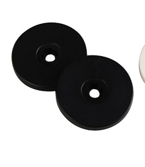

# UITWERKING

> Morgane Bekaert - Web of Things - 3NMD

## Verschillende tags

Er zijn heel wat verschillende soorten RFID en NFC-tags te verkrijgen. Ik heb vanop school deze verschillende tags meegenomen om te starten met de uitwerking van het onderwerp RFID & NFC.

Na mijn onderzoek over dit onderwerp ben ik op zoek gegaan hoe ik enkele ideeën zou kunnen omzetten naar iets werkend. Hiervoor ben ik opzoekingen beginnen doen hoe ik de tags die ik ter beschikking had zou kunnen lezen of hoe ik er iets naar zou kunnen schrijven. Ik had ook een RFID-reader ter beschikking van school. Na enkele weken kreeg ik ook een NFC-reader voor de Raspberry Pi. Aangezien er maar 1 lezer ter beschikking was hebben Ari & ik een deel van het onderzoek samen moeten uitvoeren. 

## Iphone - App 

Eerst probeerden we de tags te lezen met verschillende applicaties dat te vinden zijn in de appstore. We hebben er verschillende uitgetest. 'NFC Tools' & 'NFCScanner' waren het meest gebruiksvriendelijk om de tags te lezen dus hebben zowel Ari als ik verder gewerkt met deze twee. We merkten dat de kaart niet kon gelezen worden met de applicaties maar de sticker & sleutelhanger wel. 

Met de oranje app (NFC Tools) kon je heel gemakkelijk de tags lezen. Dit kan je doen door de tag tegen de camera te houden aan de achterkant van je iPhone, maar ook als je het tegen de frontcamera houdt werkt het en wordt de tag gelezen. Na het lezen van de tag zie je in deze app heel wat informatie zoals: Tag type, Serial number, Protected by password, memory information, data format, size, writable,... 

Met deze app kan je ook gemakkelijk zaken naar de tag schrijven. Bij het klikken op 'write' krijg je 3 opties te zien: add a record, more options & Write. Om iets nieuw te schrijven klik je op add record, dan krijg je een lijst met verschillende opties zoals bijvoorbeeld text, url, social networks, file, mail, contact, phone number, facetime, location, wifi network, ... 

In mijn voorbeeld dat je hieronder ziet gebruikte ik de blauwe sleutelhanger & de url record. Als je deze kiest kan je een url ingeven. Na het toevoegen van de record zie je dat er naast write het aantal bytes van de record komt te staan. Bij de volgende stap klik je op write/16bytes. Er komt een pop-up venster om de NFC-tag opnieuw te scannen. Na het scannen staat de URL op de NFC-tag. Dit testte ik nog eens door de tag te lezen. De url kwam tussen alle infogegevens. Wanneer ik op de URL klikte kwam ik terecht op de juiste site. 

Ik wou nog eens testen of de url effectief op de tag staat dus ik opende een tweede app, namelijk NFCScanner. Bij het scannen van dezelfde sleutelhanger kwam de url en kon ik opnieuw naar de site surfen. 

Ook door gewoon de NFC-tag tegen je camera te houden kwam er een pop-up melding om naar de site te surfen. Het was dus niet noodzakelijk om de app te open. Je hoeft hem zelf niet te downloaden als je de NFC-tag wil lezen, dit komt doordat de nieuwste smarphones een functie hebben waarbij ze NFC-tags kunnen lezen.

## Laptop - Reader

Na het gebruiken van de verschillende applicaties zijn we beiden beginnen werken met de reader. Hiermee zou je chips moeten kunnen uitlezen en bewerken via de laptop. De lezer dat je hier ziet is een windows reader dus moest deze aangesloten worden op een windows laptop. Aangezien ikzelf een mac heb, gebruikte ik mijn vroegere windows laptop.

Bij het insteken van de reader installeert hij automatisch nodige software om de reader te laten werken. Nadat als deze software op de laptop stond hebben we eerst gecheckt of de reader effectief werkte op de laptop. Door het openen van notities, en je  cursor in een notitie blad te zetten krijg je een id als je de kaart scant. Als je de kaart boven de reader houdt komt er een pieptoon en verscheen er bij mij **Ààà&à&"(&)**. Normaal zou er en id van cijfers moeten opkomen. Het feit dat er bij mijn laptop geen cijfers opkwamen komt doordat mijn mijn laptop een belgisch toetsenbord heeft. Wanneer ik mijn toetsenbord op Nederland zou zetten zou ik volgende code krijgen **0001013515**. 

Nadat we onderzocht hadden of de reader werkte hebben we nog andere softwares geïnstalleerd om de tags te kunnen lezen en of bewerken. Ik installeerde: IDRW V3 T5577 EM4305 Write Read Software.  

Met deze software en een RFID-reader zou je bijvoorbeeld de blauwe sleutelhangers moeten kunnen lezen. Op het eerste zicht gebeurde er niet veel bij mij. Bij het klikken op read gebeurde er niets, de software werkte dus niet op mijn laptop. Op de sites stond er ook de software IDRW, maar ook deze werkte jammer genoeg niet. 

Online vond ik dat RFID-tags niet werken met NFC apparatuur. Het feit dat de kaart werkt met de reader en niet met de NFC apps kan dus verklaren dat het een RFID-tag is. We kunnen dus ook besluiten de de sleutelhanger & de sticker NFC-tags zijn want deze werken met de NFC apps op de gsm en niet met de RFID windows reader. 

Aangezien deze software niet werkte hebben we verder gezocht naar andere programma's, hierdoor merkten we dat heel wat programma's dat we tegenkwamen al heel oud zijn. Gezien alle software die online stond niet werkte met de lezer, zowel niet voor het lezen, als voor het schrijven zijn we op zoek gegaan naar een alternatief. Dit leidde naar een Github repo van een gebruiker die alle Windows software had omgezet naar een Python Script om het zo te doen werken. Ook hier kwam er telkens een error na het clonen van de code en het aanpassen van het id naar de reader die wij hebben. Achteraf gezien lijkt het logisch dat dit niet werkt, aangezien de software waarop deze code is gebasseerd niet werkt. Hoewel de software de lezer herkent gaf hij ons nooit het gewenste resultaat. 

#### Code
Eerst wordt de library van de RFID-lezer ingeladen. Daarna wordt er geprobeerd om de klasse te instantiëren. Indien dit niet lukt gaat men een error printen.  
Hierna wordt er beroep gedaan op 2 methodes van de klasse om zo de data van de tag te halen en de ID te printen in de console.
Als laatste zou men ook nog een geluidje afspelen.

Voor de geïnteresseerden de GitHub repo vind je [hier](https://github.com/charlysan/pyrfidhid?fbclid=IwAR1maodXIQkYqWn5IBbzoO5qR21JCa-aEIVmBvZOMywDSxYtpdn6gjlRSsU)

## Raspberry Pi
De voorlaatste week kregen we dan een NFC-lezer voor de Raspberry PI, nieuwe hoop om dit wel werkend te krijgen. Aangezien al onze vorige opzoekingen niet werkten, zijn we meteen beginnen zoeken naar documentatie hierover. Beiden hoopten we dat we hiermee wel iets zouden kunnen schrijven naar de NFC-tags.

### Software nxp
Als eerste hebben we de software van nxp geïnstalleerd op de Raspberry Pi. Bij het installeren kregen we geen errors dus we dachten dat we op goede weg waren om het werkend te krijgen. Helaas, er bleef in onze terminal “waiting for tag or device…” staan ook al legden we er verschillende tags op. Deze optie werkte dus helaas ook niet. 

### Python scripts
Gezien de meegeleverde software niet werkte zijn we opnieuw beginnen zoeken naar alternatieven. Zo zijn Ari & ik terecht gekomen op de Github van een gebruiker, Tom. Hij stelde een soort schil rond de originele software beschikbaar. Dit was geschreven in python zodat het gemakkelijk te gebruiken is met een Raspberry Pi, met dit script zouden we de NFC-reader moeten kunnen gebruiken. Jammer genoeg hebben we dit ook niet werkend gekregen. Het is heel moeilijk om het precieze probleem te vinden omdat we moeilijk kunnen nagaan of de randapparatuur werkt of juist is aangesloten, er is geen lichtje dat brandt en er is ook geen geluidje te horen. Nog een extra moeilijkheid was dat we geen errors te zien kregen in onze terminal, zo konden we het probleem dus ook niet detecteren. 

#### Code

Eerst moesten we een DEB file downloaden vanop de nxp website. Na het installeren van deze file konden we starten met de library te installeren. Dit deden we met volgende commando's. 

> $ sudo apt-get update  

> $ sudo apt-get install build-essential cmake python3-dev python2.7-dev  

> $ sudo dpkg -i NFC-Reader-Library-4.010-2.deb  

Hierna konden we verder met de installatie, dit moest met volgend commando. 

> $ pip install nxppy

Dan konden we beginnen met de code.
Er worden eerst 2 libraries ingeladen. Uit deze library wordt er een klasse gehaald die dan wordt geïnstantieerd. 
 
Daarna wordt er gebruik gemaakt van een while om de reader continu te laten lezen.
Hierbinnen gaat men proberen de UID op te halen aan de hand van een methode uit de hierboven ingeladen klasse, als deze is ingeladen wordt de UID geprint. Indien dit niet werkt wordt er een error weergeven.

Voor de geïnteresseerden de GitHub repo vind je [hier](https://github.com/svvitale/nxppy?fbclid=IwAR2rAeZNFb1clS0w4ukiZ3H0pGYtLuPlG-KhiW2aCj39ys-OlzpVyn5bh44)

## Conclusie

Jammer genoeg hebben we dus niets kunnen schrijven naar de tags. We hebben heel wat verschillende zaken geprobeerd. Als eerste de applicatie op de Iphone, hiermee konden we bepaalde NFC-tags lezen en er ook iets naartoe schrijven. Het tweede waar we beiden onderzoek naar uitgevoerd hebben was de reader, om aan te sluiten op een windows computer. Hiermee konden we enkel het id van de kaart lezen. Met de software konden de tags ook niet gelezen worden en er kon ook niets naartoe geschreven worden. De Python code werkte ook niet, dit kan liggen aan het feit dat  de software op voorhand al niet werkte. Wat we wel konden concluderen is dat het met deze reader enkel mogelijk zal zijn om RFID-tags te lezen, aangezien er geen enkele NFC-tag op werkt. Wanneer we de NFC-tags op de reader legden, kregen we geen id in onze notities.

Als laatste hebben Ari & ik de Raspberry Pi gebruikt. We hadden hiervoor een NFC-lezer ter beschikking. Hier hebben we ook verschillende zaken onderzocht. Als eerste hebben we de software van NXP geïnstalleerd, we dachten dat deze ging werken maar wanneer we een tag op de lezer legden gebeurde er niets. Aangezien deze software niet werkte hebben we een alternatief gezocht. Met code geschreven in Python hoopten we de tags op zijn minst te kunnen lezen met de reader. Maar ook dit hebben we jammer genoeg niet werkend gekregen. 

Het was moeilijk om te achterhalen waar het probleem precies zit. We konden niet nagaan of de tags werkten, welke soort tag het was, welke versie,... Bij de raspberry Pi kregen ook niet veel output, waardoor we niet verder konden onderzoeken waar het probleem precies ligt. Ook  was de documentatie van de NFC-lezer voor op de Raspberry Pi al heel oud, Veel documentatie was 5 jaar (of langer) oud, hierdoor was er software die in de documentatie gebruikt werd niet meer beschikbaar om te downloaden op onze Raspberry Pi.

[Informatie RFID & NFC](https://morgbeka.github.io/onderzoeksdossier/#rfid)  
[Bronnen](https://morgbeka.github.io/bronnen/#bronnen)
